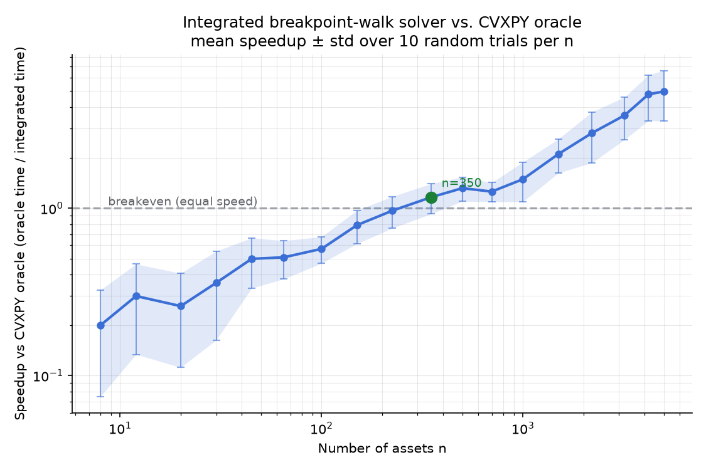
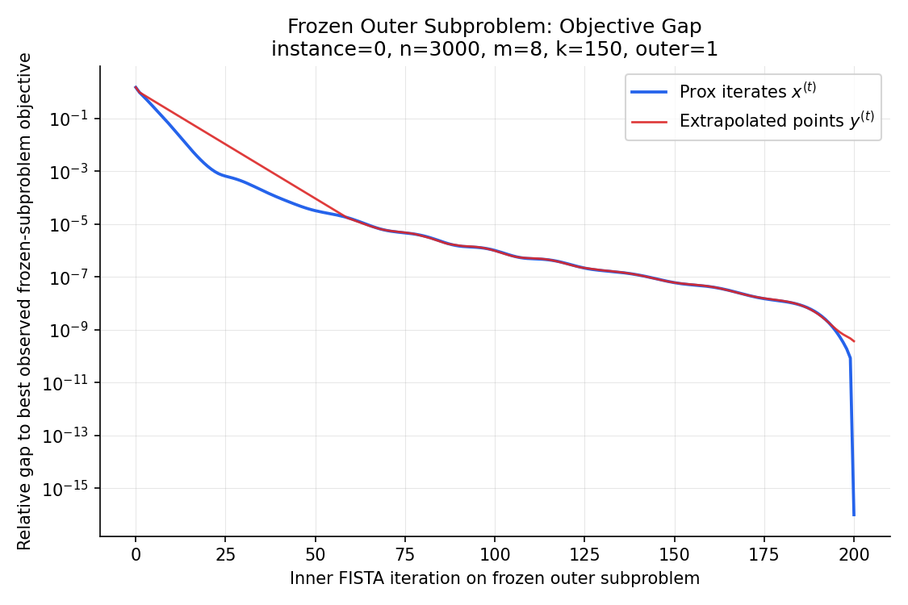
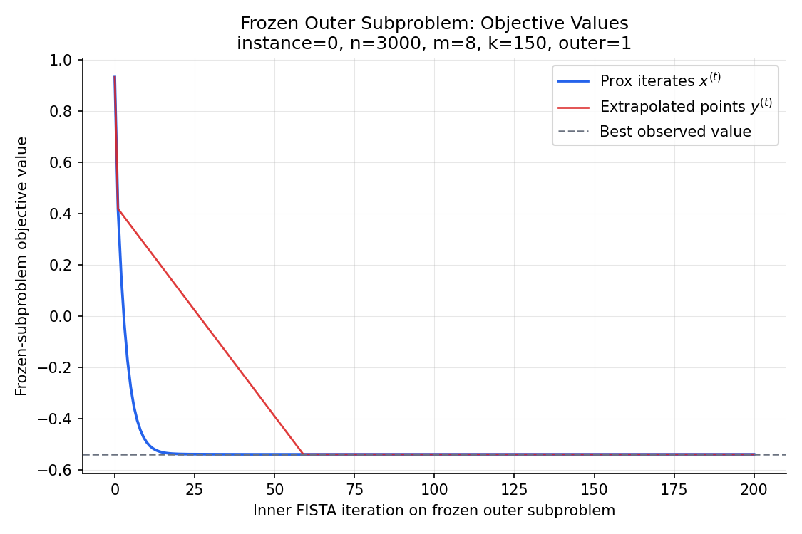

# PALM-FISTA Enhanced Algorithm for Sparse Portfolio Optimization

This directory contains a reproducible implementation of a first-order solver for a sparse long-only portfolio problem with additional linear exposure constraints. The method combines:

- an outer proximal augmented Lagrangian loop for the linear constraints,
- an inner FISTA loop for the frozen primal subproblem,
- an exact simplex-constrained proximal step built from Moreau decomposition, PAVA, and a breakpoint walk.

The code is designed to answer two practical questions:

1. Can we solve the reduced sparse portfolio model without lifting it into a much larger CVXPY problem at every iteration?
2. When does the custom first-order method become faster than a generic convex solver while keeping essentially the same objective value?

## Problem solved

The solver minimizes

$$
\min_{x \in \mathbb{R}^n} \{ \sigma^2 x^\top \Sigma x - \mu^\top x + \tfrac{1}{\gamma} g(x) \}
\quad \text{s.t.} \quad
x \ge 0,\; \mathbf{1}^\top x = 1,\; l \le Ax \le u.
$$

Interpretation:

- `x` is the portfolio weight vector.
- `x >= 0` and `1^T x = 1` mean the portfolio is long-only and fully invested.
- `l <= A x <= u` enforces extra linear exposure limits.
- `sigma^2 x^T Sigma x - mu^T x` is the standard risk-return tradeoff.
- `g(x) / gamma` is the sparsity-inducing portfolio regularizer.

The regularizer `g(x)` comes from the lifted perspective model

$$
g(x) = \tfrac12 \min_z \{ \sum_{i=1}^n \tfrac{x_i^2}{z_i} :
z_i \in [0,1],\; z_i \ge x_i,\; \sum_{i=1}^n z_i \le k \}.
$$

So the implementation solves the reduced `x`-only problem while preserving the structure of the original sparse portfolio formulation.

## What the algorithm does

At a high level, each outer iteration does three things:

1. Freeze the current multiplier and penalty parameters.
2. Solve the resulting primal subproblem approximately with FISTA.
3. Update the inequality multipliers and penalty strength.

### Outer loop: proximal augmented Lagrangian

The two-sided exposure constraints are rewritten as

$$
Bx - b \le 0, \qquad
B = \begin{bmatrix} A \\ -A \end{bmatrix}, \qquad
b = \begin{bmatrix} u \\ -l \end{bmatrix}.
$$

For fixed outer variables `(x_center, p, rho, eta)`, the code minimizes the frozen objective

$$
F_r(x) = \sigma^2 x^\top \Sigma x - \mu^\top x + \tfrac{1}{\gamma} g(x) + \tfrac{1}{2\rho} \big( \|[p + \rho(Bx-b)]_+\|_2^2 - \|p\|_2^2 \big) + \tfrac{1}{2\eta} \|x - x_{\mathrm{center}}\|_2^2.
$$

In plain language:

- the original objective says what portfolio we want,
- the augmented term discourages exposure-constraint violations,
- the proximal term stabilizes the outer method and prevents wild jumps.

### Inner loop: FISTA

For the frozen subproblem, the code applies FISTA:

- `y^(t)` is the extrapolated momentum point,
- a gradient step is taken at `y^(t)`,
- the custom prox produces the corrected point `x^(t+1)`.

This is why the code stores both the prox iterates and the extrapolated points in the frozen-subproblem diagnostic plots.

### Exact prox on the simplex

The nontrivial step is

$$
\mathrm{prox}_{\tau g + \delta_{\Delta_n}}(v), \qquad
\Delta_n = \{ x \ge 0 : \mathbf{1}^\top x = 1 \}.
$$

The implementation computes it in three layers:

1. Use Moreau decomposition to reduce the free prox to a conjugate-side prox.
2. Use PAVA to exploit the sorted block structure of that conjugate prox.
3. Enforce the simplex equality by solving for one scalar multiplier `nu` such that the final prox output sums to `1`.

The function `prox_moreau_simplex_breakpoint_walk` is the exact prox engine. The code looks complicated because it is optimized, but conceptually it is only doing this:

- shift the vector by a scalar `nu`,
- evaluate the free prox,
- track how the solution changes between breakpoints,
- stop when the sum constraint is exactly satisfied.

## Why this is faster than lifting everything into CVXPY

The CVXPY oracle solves the lifted `(x, z)` formulation directly. That is robust and accurate, but it becomes expensive as `n` grows.

The custom solver avoids solving a large generic cone program at each iteration. Instead it uses:

- matrix-vector operations,
- a closed-form gradient,
- an exact structured prox,
- warm starts for the simplex multiplier.

This is why the method is especially attractive in the medium-to-large scale regime.

## Repository structure

- `core.py`: instance generation, objective helpers, exact prox, PAVA, breakpoint walk.
- `solver.py`: outer proximal augmented Lagrangian loop and inner FISTA solver.
- `benchmark.py`: one-shot oracle vs integrated-solver benchmark and diagnostic plots.
- `scaling_study.py`: timing study over a geometric grid of asset dimensions.
- `test_breakpoint_walk.py`: validation checks for the breakpoint-walk prox.
- `results/`: saved plots and CSV summaries.

## Requirements

- Python 3.10+
- `numpy`
- `cvxpy`
- `matplotlib`
- `tqdm`
- `numba` optional but recommended for the prox kernels

## Quick start

Run the benchmark with restart enabled:

```bash
python run_benchmark.py --n-values 8 12 --instances-per-setting 1
```

Run the same benchmark without restart:

```bash
python run_benchmark.py --n-values 8 12 --instances-per-setting 1 --no-restart
```

Run the scaling study:

```bash
python scaling_study.py
```

Run the breakpoint-walk tests:

```bash
python test_breakpoint_walk.py
```

## Numerical experiments

The main timing study is saved in [results/scaling_results.csv](results/scaling_results.csv) and visualized in [results/scaling_plot.png](results/scaling_plot.png).

Settings used in the saved study:

- `n` ranges from `8` to `5000`,
- `k = max(2, round(0.05 n))`,
- `10` random trials per `n`,
- restart-enabled inner FISTA,
- CVXPY oracle used as the baseline.

### Performance summary from the saved results

- Mean speedup first exceeds `1x` at `n = 350`.
- At `n = 350`, mean oracle time is about `1.69s` and mean integrated-solver time is about `1.51s`.
- At `n = 5000`, mean oracle time is about `240.66s` and mean integrated-solver time is about `52.40s`.
- At `n = 5000`, the mean speedup is about `4.98x`.
- The saved scaling study has `100%` convergence rate on every tested `n`.
- The worst recorded maximum relative objective gap across the study is about `3.67e-6`.

These numbers support the main claim of the project: the custom first-order method reaches essentially the same objective value as the oracle while becoming materially faster once the asset dimension is moderately large.

### Plots included

Speed comparison against CVXPY:



Frozen inner-subproblem diagnostics without restart:





How to read the frozen-inner plots:

- the blue curve is the corrected prox-iterate sequence `x^(t)`,
- the red curve is the extrapolated momentum sequence `y^(t)`,
- the red curve can overshoot because it is the aggressive look-ahead point,
- the blue curve is usually smoother because it is recorded after the prox correction.

## Theoretical foundations

This implementation is motivated by three standard ideas.

### 1. Proximal augmented Lagrangian methods

The outer loop follows the standard pattern:

- solve a proximal augmented Lagrangian primal subproblem,
- update the inequality multipliers,
- adapt the penalty parameter as needed.

This is the mechanism that handles the linear exposure constraints efficiently without handing the whole lifted model to a generic solver at every step.

### 2. Accelerated proximal gradient methods

The frozen inner subproblem is a structured composite optimization problem. FISTA is used because it is simple, well understood, and effective for large smooth-plus-nonsmooth problems.

### 3. Structured proximal operators

The practical speedup depends heavily on computing the inner prox exactly and cheaply. The Moreau + PAVA + breakpoint-walk combination is what makes the inner solver scalable.

## Notes on restart

The code supports a value-based restart rule for the inner FISTA loop. On some instances it helps significantly by cutting wasted momentum steps; on other instances it does nothing because the non-restarted trajectory is already well behaved.

In the saved scaling study with restart enabled, the average speed crossover appears around `n = 350`. The included diagnostics also show that oscillation is instance-dependent rather than universal.

## Bibliography

1. Adeyemi D. Adeoye, Puya Latafat, and Alberto Bemporad. *A proximal augmented Lagrangian method for nonconvex optimization with equality and inequality constraints*. arXiv preprint `arXiv:2509.02894`, 2025.
2. Jiachang Liu, Soroosh Shafiee, and Andrea Lodi. *Scalable First-order Method for Certifying Optimal k-Sparse GLMs*. Proceedings of the 42nd International Conference on Machine Learning, Proceedings of Machine Learning Research 267:39455-39481, 2025.

## Reproducibility

The saved plots and CSV files under `results/` are generated directly by the scripts in this directory. The benchmark and scaling-study scripts use explicit seeds, and the scaling study stores both the raw per-trial timings and the aggregated summary table.
